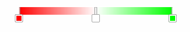

[](http://travis-ci.org/survivejs/react-component-boilerplate) [](https://www.bithound.io/github/survivejs/react-component-boilerplate) [](https://david-dm.org/survivejs/react-component-boilerplate)
# react-gradient-color-picker

This is a simple gradient color picker integrated with react. 
The reason I decide to develop it since there's no usable gradient color picker on npm so far (2015/12/30). Please join me to make it better and more useful.
Please checkout the example at [here](https://www.npmjs.com/package/react-gradient-color-picker).



## Development

Please checkout the code at [here](https://github.com/javidhsueh/react-gradient-color-picker).
* Linting - **npm run lint** - Runs ESLint.
* Testing - **npm test** and **npm run tdd** - Runs Karma/Mocha/Chai/Phantom. Code coverage report is generated through istanbul/isparta to `build/`.
* Developing - **npm start** - Runs the development server at *localhost:8080* and use Hot Module Replacement. You can override the default host and port through env (`HOST`, `PORT`).

## Installation
```sh
npm install --save react-gradient-color-picker
```

## Properties
### stops {array} default: 
```js
[
	{offset: 0.0, color: '#f00'},
	{offset: 0.5, color: '#fff'},
	{offset: 1.0, color: '#0f0'}
]
```

The color stops of the color map.

### onChange {func}

Callback called on every value change.
The return value is a d3 linear color scale. Input value range is between 0 to 1. 
It only triggers when the stop color changes or end of dragging the handlers.

### width {number}
The width of the component.

## Highlighting Demo

```js
render() {
	var style = {
		width: '300px'
	};
	var stops = [
		{offset: 0.0, color: '#f00'},
		{offset: 0.5, color: '#fff'},
		{offset: 1.0, color: '#0f0'}
	];
	var onChangeCallback = function onChangeCallback(colorMap) {
  		// var mappedColor = colorMap(0.8);
  		// console.log(mappedColor);
  	}
	return (
		<div style={style}>
			<ReactGradientColorPicker onChange={onChangeCallback} stops={stops}/>
		</div>
	);
}
```

## License

*react-gradient-color-picker* is available under MIT. See LICENSE for more details.

